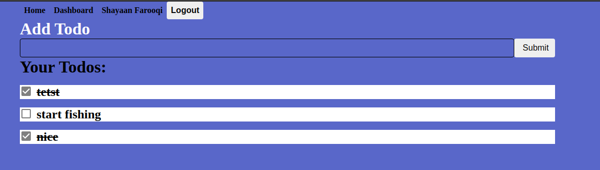

# Project 12C JAMStack Todo app with Netlify Identity, Gatsby, GraphQL, and FaunaDB. 

[Netlify Deployment](https://eru-todos.netlify.app/)

# Demo:

# Note:
If you put netlify.toml in your repo root, then you don't need to mess around with the package.json "prebuild" script where you manually cd into the functions and then install their dependencies.
Netlify will detect and install the dependencies if you correctly tell the functions directory in the root of your repo.
